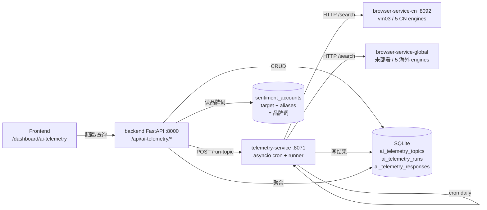

# AI 遥测(AI Telemetry)

> 每天自动向各 AI 引擎询问你关心的话题,记录答案与引用,分析品牌在 AI 时代的可见性。
> 类比海外:Profound / Peec AI / Otterly.AI / AthenaHQ
> 我们的差异:**国内 5 + 海外 5 共 10 个引擎**,海外厂只能覆盖海外那 5 个。

## 1. 功能模型

```
[用户配置话题]──▶[每天定时跑批]──▶[Browser-service 询问 AI]──▶[结果落库]──▶[Dashboard 分析]
   品牌问询           daily cron          5 国内 + 5 海外         answer/cites    KPI + 趋势 + 引用分析
```

**一个话题(topic)**:
- N 条 query(最多 10 条,例如:`世纪互联怎么样` / `国内 IDC 推荐` / `VNET vs 万国数据`)
- 一组要跑的引擎(默认 5 个 CN 引擎,可选海外 5 个)
- 启用后:每天自动跑 1 次,每次 `len(queries) × len(engines)` 个 (engine, query) 调用
- 单次跑批耗时:小话题 5-7 分钟、大话题 30-40 分钟(瓶颈是豆包,~120s/query)

## 2. 页面结构(`/dashboard/ai-telemetry`)

3 个 tab,默认进 **概览**:

```
┌─ 概览 ─┐ ┌─ 话题配置 ─┐ ┌─ 跑批结果 ─┐
   KPI         CRUD          原始数据
   趋势        新建话题      engine×query 矩阵
   引用分析    立即跑一次    答案 / citations / 视频回放
```

## 3. 概览页详解

### 3.1 数据时间窗口

```
[─── 上期 (period 天) ───][─── 本期 (period 天) ───]
                          ↑                       ↑
                  period_days 天前               现在
```

- 周期可选 **7 / 30 / 90 天**(顶部右侧切换)
- 本期 = `[now - period, now]`
- 上期 = `[now - 2*period, now - period]`
- `delta_pct = (本期 - 上期) / 上期 × 100`,上期=0 时返回 `null`,前端不显示箭头

### 3.2 4 个 KPI 卡

| # | 卡 | 主数字 | delta 箭头 | sparkline |
|---|---|---|---|---|
| 1 | **AI 可见度** | 本期 `answer 含品牌词` 的成功 response 数 ÷ 本期总成功 response 数 × 100 | (本期可见度 − 上期可见度) / 上期可见度 × 100 | 本期每天的 citations 数 |
| 2 | **AI 引用数** | 本期所有 response 的 `citations.length` 求和 | (本期总引用 − 上期总引用) / 上期总引用 × 100 | 本期每天引用数 |
| 3 | **引用增长率** | **就是卡 #2 的 delta_pct**,拎出来当主数字;正绿负红 | 没有(它本身就是 delta) | 没有 |
| 4 | **覆盖 AI 引擎** | 本期有 ≥1 成功 response 的引擎数 | 同上 vs 上期 | 没有 |

#### 品牌词来源(卡 #1 的关键)

**不在话题里重配**,从用户的「品牌设置」(`sentiment_account.target + aliases`)直接取:

```python
brand_keywords = [acc.target] + acc.aliases   # e.g. ["世纪互联", "VNET", "21Vianet"]
hit = any(k.lower() in r.answer.lower() for k in brand_keywords)
```

如果用户没配品牌词,卡 #1 显示 0,页面顶部出现琥珀色警告:`未配置品牌词,AI 可见度无法计算...`。

### 3.2.5 v1.3 新增模块(KPI 行下面、趋势图上面)

| 块 | 口径 | 价值 |
|---|---|---|
| **AI 声量份额 SAIV** | 品牌被提及次数 / (品牌 + 所有竞品) 被提及总次数 | 行业级 AI 声量占比 (对标 Profound SAIV) |
| **命中位置分布** | 每条命中切 lead / body / tail 三段统计占比 | 开头位 mention 权重最高 |
| **AI 答案优选率** | 答复中品牌作为主推荐(非顺带提及)的累计比例 | 跨累计跑批维度,口径较严 |
| **竞品引用份额差** | 品牌 + 各竞品并排,按本期被提及次数排序的水平柱 | 看相对份额、识别强敌 |
| **Intent 分布** | 建话题时 query 已按意图聚簇,看每簇 mention 率 | 低 mention 簇 = 内容弱点,该补 |

> 这 5 个块在 `/api/ai-telemetry/topics/{id}/overview` 同一个端点里返回;前端在 KPI 行下面、趋势图上面渲染。竞品名单走 sentiment_account.competitors,品牌词走 target + aliases。

### 3.3 趋势图(AI 引用趋势)

```
AI 引用趋势      ● DeepSeek  ● 通义  ● 文心  ● 豆包  ● 元宝
┌─────────────────────────────────────────────────────┐
│ 30 │         ╱╲                              ┌────┐│
│    │        ╱  ╲          ╱─────╮          │05-12│ │
│ 20 │   ╱───╯    ╲────────╯       ╲          │ds:14│ │
│ 10 │  ╱                            ╲          └────┘│
│  0 │──────────────────────────────────╲            │
│    └─────────────────────────────────────           │
│      04-13   04-20   04-27   05-04   05-11         │
└─────────────────────────────────────────────────────┘
```

| 项 | 说明 |
|---|---|
| X 轴 | 每天一个点;7 天全显示,30/90 天每 5-12 天一个 tick |
| Y 轴 | 当天该引擎所有 response 的 `citations.length` 之和 |
| 线 | 每个本期出现过的引擎一条,固定配色(`ENGINE_COLORS` map) |
| Tooltip | hover 显示日期 + 所有引擎当天数值 |
| 空状态 | 本期 0 数据时显示提示卡,引导用户跑批 |

### 3.4 引用分析(3 个 block)

#### ① 引用平台 Top 10

```
1. zhihu.com         ████████████████  42  18.0%
2. 21vianet.com      ████████████      36  15.4%
3. baike.baidu.com   █████████         28  12.0%
```

- **口径**:本期所有 response 的 `citations.domain` 累加,降序排前 10
- 视觉:1-3 名 rank chip 高亮(主色),favicon 32px,横向 bar(宽度按比例),count + 百分比

#### ② 自家 vs 其他

```
       ┌──────┐
   ⭕   │ 10.7%│   ↑ 2.1% vs 上期
       └──────┘    
  ● 自家 24    ⬜ 其他 200
```

**这是衡量 AI 是否引用你自己网站/官号的核心 KPI**(对标 Profound 的 "Owned Citation %")。

- **口径**:对每个 `citation.domain`(小写化)做品牌词 substring 匹配,命中=自家,不命中=其他
- **算法**:
  ```python
  domain_lc = cit.domain.lower()  # "21vianet.com"
  if any(kw.lower() in domain_lc for kw in brand_keywords):
      owned += 1
  else:
      other += 1
  ```
- **行业基准**:Profound 公布的类别级问题里 owned 平均仅 4.3%
- **配置 tip**:品牌词中如果只有中文(`世纪互联`),无法匹配英文域名(`21vianet.com`),
  → 需要在账户「品牌设置」的 aliases 里加 domain 关键词(`21vianet`, `vnet`,不带 `.com` 即可)
- delta:本期 `owned_pct` vs 上期 `owned_pct` 的百分点变化

#### ③ 引擎 × 平台 命中矩阵 heatmap

```
         zhihu  21vianet  baike  sina  bilibili  ...
DeepSeek   8       3        2     1      —       ...
通义       5       7        3     —      —       ...
文心       2       1        9     —      4       ...
豆包       —       —        —     —      —       ...
元宝       1       —        2     —      —       ...
```

- 行 = 配置的引擎;列 = Top 10 引用平台
- 格子色深 = 该引擎引用该平台的次数(alpha 0.30-0.95 跨度,5 段量化色阶图例右上)
- 空格(0)= 虚线占位
- **价值**:看引擎差异化偏好(例:DeepSeek 偏知乎、文心偏百家号、ChatGPT 偏外文 wiki)

## 4. 数据流 / 架构



### 4.1 后端端点(`backend/geo/api/ai_telemetry.py`)

| Method | Path | 用途 |
|---|---|---|
| GET | `/api/ai-telemetry/topics` | 列表 |
| POST | `/api/ai-telemetry/topics` | 新建 |
| PUT | `/api/ai-telemetry/topics/{id}` | 改 |
| DELETE | `/api/ai-telemetry/topics/{id}` | 删 |
| POST | `/api/ai-telemetry/topics/run-now` | 同步预览(modal 立即试跑,**不入库**)|
| POST | `/api/ai-telemetry/topics/{id}/run` | 触发入库跑批(202,后台跑) |
| GET | `/api/ai-telemetry/topics/{id}/runs` | 列出某话题最近 20 次跑批 |
| GET | `/api/ai-telemetry/runs/{id}/responses` | 列出某次跑批的全部 response |
| GET | `/api/ai-telemetry/topics/{id}/overview?period=7\|30\|90` | 概览聚合(KPI + 趋势 + Top10 + owned + heatmap)|

### 4.2 telemetry-service(`services/telemetry-service/`)

| 项 | 值 |
|---|---|
| 端口 | `127.0.0.1:8071`(loopback,只给 backend 调) |
| 入口 | `app.main:app`(FastAPI + uvicorn --workers 1) |
| Scheduler | `app.scheduler`:每分钟扫一次 enabled topics,匹配 `topic.id % 24 == 当前 UTC 小时`且今天没跑过 |
| Runner | `app.runner`:asyncio + httpx,并发 3,失败 engine×query 级隔离 |
| DB | 同 backend SQLite,独立声明 ORM(可独立部署)|

### 4.3 表结构(`ai_telemetry_*`)

```sql
ai_telemetry_topics      (id, user_id, name, queries_json, engines_json,
                          enabled, last_run_at, last_run_status, ...)
ai_telemetry_runs        (id, topic_id, started_at, finished_at, status, error)
ai_telemetry_responses   (id, run_id, topic_id, engine, query, answer,
                          citations_json, video_url, error, created_at)
```

## 5. 部署(vm02)

| 服务 | systemd unit | 端口 | 启动 |
|---|---|---|---|
| backend | `geo-backend.service` | `0.0.0.0:8000` | 已有,加了 drop-in `Environment=TELEMETRY_SERVICE_URL=http://127.0.0.1:8071` |
| telemetry-service | `geo-telemetry.service` | `127.0.0.1:8071` | 新建,WorkingDirectory=`/opt/geo/services/telemetry-service`,复用 backend venv |

### 重要 env(`geo-telemetry.service` 的 `[Service]`)

```
DATABASE_URL=sqlite:////opt/geo/backend/data/geo_checker.db
BROWSER_SERVICE_CN=http://browser-cn.example.com:8092
BROWSER_SERVICE_GLOBAL=http://127.0.0.1:9999     # 占位,海外引擎未部署
TELEMETRY_PER_QUERY_TIMEOUT=180
TELEMETRY_MAX_CONCURRENT=3
SCHEDULER_ENABLED=1
```

### redeploy 操作

```bash
# 在 vm02 上
cd /opt/geo && git pull --ff-only origin feaure/yuqin
sudo systemctl restart geo-backend.service geo-telemetry.service
cd frontend && npm run build                 # dist 给 nginx 直接读
```

## 6. 真实跑批延时(vm03 实测,2026-05-12)

5 个 CN 引擎跑同一条 query 的耗时:

| 引擎 | 单次耗时 |
|---|---|
| yuanbao | **26s** |
| deepseek | 37s |
| qwen | 73s |
| wenxin | 74s |
| doubao | **121s** ⚠️ 最慢 |

平均 **~66s/query**。并发 3 时单话题预估:

| 话题规模 | combos | 预估时长 |
|---|---:|---|
| 3 query × 5 CN engines | 15 | **5-7 分钟** |
| 5 query × 10 engines | 50 | 15-20 分钟 |
| 10 query × 10 engines | 100 | 30-40 分钟 |

## 7. TODO / 已知限制

| 项 | 状态 | 说明 |
|---|---|---|
| 海外 5 引擎 browser-service-global | ❌ 未部署 | 配置了也跑不出来,response.error 静默 |
| 视频回放跨机访问 | ❌ | 视频文件在 vm03 容器内,vm02 nginx 没暴露 |
| 引用类型 8 类分类 | ❌ | Profound 主打 KPI,需用户配 自家/竞品/媒体/PR/机构/社交 域名白名单 |
| 新增/消失引用源 diff | ❌ | 数据现成但 UI 未做,需要 ≥2 周期数据才有意义 |
| 域名共现 / 引擎一致性 | ❌ | 网络图复杂度高,数据 <100 response 时是噪音 |
| 倒计时"距下次跑批 X 小时" | ❌ | 抄 Peec AI 的体验细节 |
| 话题数 / Query 数 quota | ❌ | 目前无限制,后续接 membership 档位 |
| MySQL 迁移 | ❌ | 目前同 backend SQLite;sentinel v2 切 MySQL 时一起迁 |

## 8. 文档历史

- 2026-05-12:初版(概览页 KPI / 趋势图)
- 2026-05-12 晚:加引用分析 3 个块(Top10 / Owned / heatmap)
- 2026-05-12 当晚:视觉优化 + 本文档新增架构 / 部署 / 端点章节
- 2026-05-14:补 v1.3 模块(SAIV / 命中位置 / 优选率 / 竞品份额 / Intent 分布);前端每个 KPI/section 加 `?` 悬浮提示(`tip*` i18n key)
