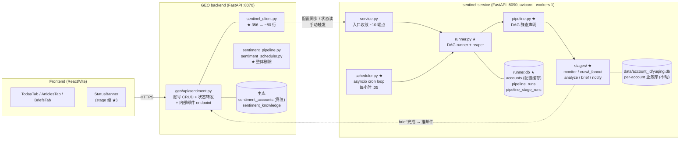
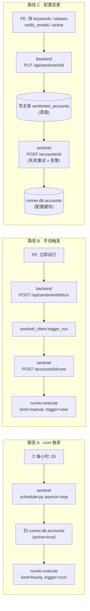
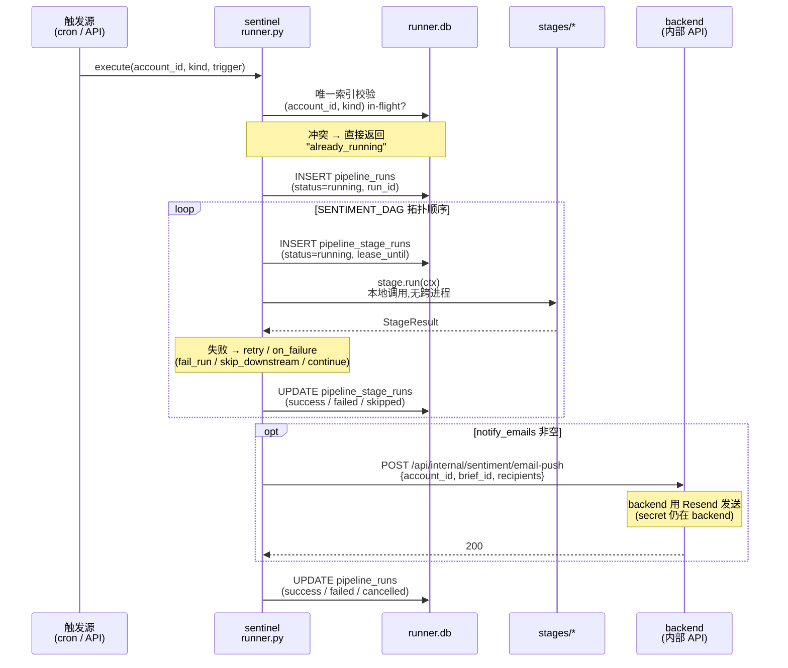
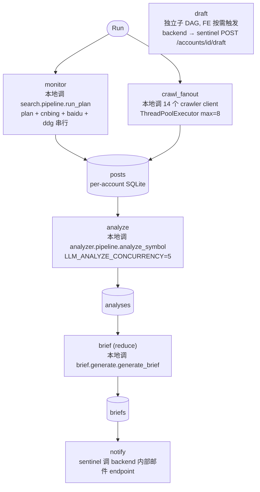

# 舆情系统架构 v2(重构目标 · sentinel 自治版)

> 状态:方向已确认,细节待重构期落地
> 创建日期:2026-05-08
> 上一版:[`sentiment-architecture.md`](./sentiment-architecture.md)(描述重构前现状,**不要原地覆盖**)
> 配套文档:[`../../docs/sentiment-gap-analysis-vs-wisersone.md`](../../docs/sentiment-gap-analysis-vs-wisersone.md)(对标慧科,本次重构暂不并入)
>
> **核心切面**:sentinel-service 从 v1 的 "被动加工厂(被 backend 用 18 RPC 串起来)" 升级为 **"自主舆情引擎"**(自跑 cron + 自管 DAG + 自持运行时状态);GEO backend 退化为 **"账号配置 + FE API 网关"**,**不再做调度、不再做 pipeline 编排**。
>
> 预计工作量 15-25 工作日,**分 phase 灰度上线,不是单 PR**。

---

## 0. 重构动机

把 v1 散在 backend `sentiment_scheduler.py` + `sentiment_pipeline.py` + `sentinel_client.py` 三处的"调度 / 编排 / 状态"逻辑,**整体下沉到 sentinel-service**;backend 只剩下 "拥有账号配置 + 给 FE 提供 API"。

**一句话**:让 sentinel 真正成为"舆情引擎",backend 不再知道"什么时候跑、跑到哪一步、哪个 stage 失败了"。

要解决的具体痛点:

| 痛点 | v1 现状 | 锚点 | v2 是否覆盖 |
|---|---|---|---|
| 调度与执行跨进程,语义割裂 | scheduler 在 backend、执行在 sentinel,跨 18 RPC 串起来,失败语义难收敛 | `sentiment_scheduler.py` + `sentiment_pipeline.py` | ✓ 全在 sentinel 内 |
| 隐式 DAG | 14 crawler + 4 主 RPC 顺序、并行、容错策略,全靠 200 行 if-else 表达 | `sentiment_pipeline.run_pipeline_for_account()` | ✓ 显式 DAG 声明 |
| HTTP 长连接 + 业务级超时 | `run_analyze=1800s`、`run_brief=1200s`、`run_monitor=1200s`,任一卡住整个 pipeline 卡住 | `sentinel_client.py` | ✓ 没有跨进程长连接,sentinel 内部 await |
| 三层防重入语义重复 | scheduler `max_instances=1` + 主库 `last_run_status='running'` + `sentinel_cleanup` 60 分钟僵尸回收 | scheduler + pipeline + cleanup job | ✓ 收敛为 sentinel runner 内一处 + DB 唯一索引 |
| stage 级失败粒度缺失 | 14 crawler 失败被吞,无独立 retry / 跳过 / 补跑 | `sentiment_pipeline._run_crawlers()` | ✓ stage 级 retry + 状态留痕 |
| 前端无中段进度 | UI 只能拿到 `last_run_status` 顶层四态 | `Sentiment.tsx` / `StatusBanner` | ✓ stage 级进度 |
| backend 持有运行时状态(reconcile 困难) | `sentiment_accounts.last_run_status` + `sentiment_run_logs` 都在 backend,sentinel 跑完要回写 | 主库 + sentinel API | ✓ 运行时状态全在 sentinel,backend 通过 API 读 |

**非目标**(明确不在本次重构范围):

- monkey-patch `connect()` 多租户隔离逻辑(`service.py:35-127`)— **保留并适配 cron 入口**,不做底层重写(归到下一轮)
- 现有 5 张业务表 schema(已是 ETL-friendly,不动)
- LLM provider / 搜索引擎 / 爬虫源切换
- 引入 Redis / Celery / Airflow / Prefect / Dagster 等新基础设施
- 把 `sentiment_accounts` 表整体迁到 sentinel(本轮采用"backend 是源 + sentinel 缓存"双写)
- Resend 邮件 secret 下放(本轮采用"sentinel 完成 brief 后回调 backend 推送"反向调用)

---

## 1. 一句话定位

**Sentinel v2 = 自主舆情引擎**:内置 cron 调度、内置 DAG runner、自持运行时状态(`runner.db`)、自做僵尸回收。

**GEO backend v2 = 账号配置中心 + FE API 网关**:拥有 `sentiment_accounts` 真值;FE 写配置 → backend 同步推 sentinel 一份缓存;FE 读状态 → backend 转发 sentinel 的 `runner.db` 查询。

---

## 2. 物理拓扑



**职责切分(post-refactor)**:

- **Frontend**:不变,但 StatusBanner 可消费 stage 级进度
- **GEO backend**:拥有 `sentiment_accounts` 真值;不做调度、不做编排、不做状态聚合;状态读由 sentinel 转发
- **sentinel-service**:**自主跑**(cron + runner + state),**对 backend 弱依赖**(只在写配置 / 推邮件时跨进程通信)

---

## 3. 端到端数据流

### 3.1 触发路径(三种)



### 3.2 单次 run 执行(在 sentinel 内)



### 3.3 DAG 形态



**实际 DAG 节点数**:`(monitor ∥ crawl_fanout) → analyze → brief → notify` = **5 节点**(draft 独立,不计入)

**关键差异 vs v1**:

- 全部 stage 是**本地函数调用**,不再有跨进程 HTTP RPC,`run_analyze=1800s` 这种业务级超时不存在了
- 14 crawler 仍在 `crawl_fanout` 一个 stage 内 fanout(与 v1 行为一致,简化 DAG 节点数)
- 单 stage 失败由 runner retry_policy 决定,不靠 backend try/except
- 整个 pipeline 跑完不需要 backend 醒着(backend 短暂宕机不影响)

---

## 4. 模块清单

### 4.1 sentinel-service(本次主战场)

| 模块 | 关键文件 | 入口 | v1→v2 |
|---|---|---|---|
| Cron 调度 ★ | `scheduler.py` | startup hook 启动 asyncio loop | **新增 ~150 行**(替代 backend `sentiment_scheduler.py` 的 187 行) |
| DAG runner ★ | `runner.py` | `runner.execute(account_id, kind, trigger)` | **新增 ~600 行**:节点遍历 + retry + lease + reaper + 状态写入 |
| DAG 声明 ★ | `pipeline.py` | `SENTIMENT_DAG: DAG = ...` | **新增 ~100 行** |
| Stage 实现 ★ | `stages/{monitor,crawl_fanout,analyze,brief,notify}.py` | `def run(ctx) -> StageResult` | **新增 ~400 行**(薄 wrapper,调本地 search/crawler/analyzer/brief 模块) |
| HTTP 入口 | `service.py` | `POST /accounts/{id}`、`DELETE`、`POST /runs`、`GET /runs/{id}`、`GET /runs/latest`、读端点(保留)、`/health` | 779 行 → ~400 行;**18 写 RPC 缩到 ~5**;读端点保留 |
| 配置缓存 ★ | `storage/runner_db.py` 中的 `accounts` 表 | runner.db | **新增** |
| DAG 状态 ★ | `storage/runner_db.py` 中的 `pipeline_runs` / `pipeline_stage_runs` | runner.db | **新增** |
| 业务存储 | `storage/db.py` | `connect()` | **不动** |
| 业务模块 | `search/` `crawler/` `analyzer/` `brief/` `response/` | 各自原入口 | **不动**(被 stages/ 调用) |
| LLM 抽象 | `llm_client.py` | `chat_create()` | **不动** |
| 知识库 | `knowledge/*.md` × 3 | draft stage 加载 | **不动** |

### 4.2 GEO backend

| 模块 | v1→v2 |
|---|---|
| `sentiment_pipeline.py` | **整体删除**(223 行) |
| `sentiment_scheduler.py` | **整体删除**(187 行) |
| `sentinel_client.py` | 356 行 → **~80 行**(保留:配置同步、状态读转发、手动触发、邮件接入回调) |
| `geo/api/sentiment.py` | 484 → ~520(加内部邮件 endpoint + 状态转发改写,共 ~50 行变化) |
| `geo/models/sentiment.py` | 删 `last_run_status` / `last_run_error` 等运行时字段(保留作废,迁移期不删避免回滚断裂);`sentiment_run_logs` 表删除 |

### 4.3 Frontend

| 模块 | v1→v2 |
|---|---|
| `StatusBanner.tsx` | 74 → ~120,加 stage 级进度展示;`failed` 仍静默 |
| API 调用 | endpoint 路径不变,backend 内部转发到 sentinel |

---

## 5. 数据模型

### 5.1 主库(GEO backend,Postgres/SQLite)

| 表 | 变化 |
|---|---|
| `sentiment_accounts` | **保留**,继续作为账号配置真值;**删除运行时字段**(`last_run_status`、`last_run_error`、`last_run_at` 等;Phase 0 期间保留作展示,Phase 4 清理) |
| `sentiment_knowledge` | **保留** |
| `sentiment_run_logs` | **删除**,运行时状态全在 sentinel `runner.db.pipeline_runs` |

migration:1 个 alembic(drop `sentiment_run_logs` + drop 几个运行时字段),Phase 4 时执行。

### 5.2 业务库(per-account SQLite)— 不动

`posts` / `analyses` / `briefs` / `drafts` / `query_runs` 5 张表 schema **完全不动**。

### 5.3 sentinel `runner.db`(新增,共享 SQLite)

| 表 | 主键 | 用途 | 关键字段 |
|---|---|---|---|
| `accounts` | `account_id` | 配置缓存(backend 推送同步) | `ticker`, `aliases`, `keywords`, `keyword_groups`, `excludes`, `media_allowlist`, `notify_emails`, `active`, `synced_at` |
| `pipeline_runs` | `run_id`(自增) | 一次 DAG 执行 | `account_id`, `kind`, `trigger`, `status`, `started_at`, `ended_at`, `error` |
| `pipeline_stage_runs` | `(run_id, stage_id, attempt)` | 单 stage 单次执行 | `status`, `started_at`, `ended_at`, `error`, `output_summary` (json), `lease_until` |

**唯一约束**(收敛 v1 三层防重入到一处):

```sql
CREATE UNIQUE INDEX idx_run_active
  ON pipeline_runs(account_id, kind)
  WHERE status IN ('pending', 'running');
```

同一 `(account_id, kind)` 只能有一个未完成 run。cron / 手动 / 用户重复触发都会因约束冲突直接拒绝。

### 5.4 多租户隔离(本轮不重写,适配 cron 入口)

`service.py:35-127` 的 monkey-patch `connect()` 保留。**新增问题**:cron 入口不是 HTTP 请求,没有现成的中间件去 set `_current_account: ContextVar`。

**适配做法**:cron loop 在每个 account 处理边界手工 `_current_account.set(account_id)`(类似 HTTP 请求中间件做的事),runner.execute 入口同理。`runner.db` 的 connection 走独立的 `runner_connect()`,不经过 monkey-patch。

记 known issue:任何新子模块在 import 时早期捕获 `connect()` 仍会绕过隔离。归到下一轮重构。

---

## 6. 任务编排与状态机

### 6.1 状态机

`pipeline_runs.status`:
```
pending ─▶ running ─┬─▶ success
                    ├─▶ failed
                    └─▶ cancelled
```

`pipeline_stage_runs.status`:
```
pending ─▶ running ─┬─▶ success
                    ├─▶ failed (attempt < max → 自动回 pending 重试)
                    └─▶ skipped (上游失败 + on_failure=skip_downstream)
```

### 6.2 重入控制(从三层归一)

| v1 守卫 | v2 |
|---|---|
| backend scheduler `max_instances=1` | **删除**(scheduler 整体下沉到 sentinel) |
| 主库 `last_run_status='running'` | **删除**(运行时状态全在 sentinel) |
| backend `sentinel_cleanup` 60 分钟僵尸回收 | **删除**(sentinel runner 内置 reaper 取代) |
| **新增**:sentinel runner.db 唯一索引 + lease reaper |

### 6.3 stage 失败策略

每个 stage 在 DAG 声明里带 `retry_policy`:

- `max_attempts`(默认 1;analyze / brief 设 2)
- `backoff`(指数,封顶 60s)
- `on_failure`:
  - `fail_run`:整 run 失败(plan / monitor / analyze / brief)
  - `skip_downstream`:下游标 skipped,run 状态 = `success_with_warnings`
  - `continue`:run 继续,失败留痕(crawl_fanout 内部各 crawler 用此 — 与 v1 "失败被吞" 行为一致)

**14 crawler 失败处理**:在 `crawl_fanout` stage 内部用 ThreadPoolExecutor 并行 + 老 try/except 兜底。`stage.output_summary` 字段记录"哪几个 crawler 挂了",FE 可展示但**不算 stage 失败**。

### 6.4 lease + reaper

每个 stage 进入 running 时写 `lease_until = now + lease_duration`(默认 30 分钟,analyze 设 45 分钟)。runner 内置 reaper 协程每 5 分钟扫一次:

- 找出 `status='running' AND lease_until < now()` 的 stage
- 把它改回 `pending`(若 attempt < max)或 `failed`
- 同步处理 run 级别的 lease

取代 v1 的 `sentinel_cleanup` cron job。

### 6.5 取消 / cancel

`POST /accounts/{id}/runs/{run_id}/cancel` 写 `status=cancelled`,runner 在每 stage 边界检查;长 LLM 调用允许"标记取消但跑完当次",**不强 kill**。

---

## 7. LLM 用法

不变。重构只调用方式,不调模型 / prompt / 并发。

| 阶段 | 模型 | 并发 | 超时 | 缓存 |
|---|---|---|---|---|
| plan(monitor stage 内) | gpt-4o-mini / glm-4.5-flash | 1 | per-call 60s | system prompt 走 prompt cache |
| analyze(analyze stage) | glm-4.5-flash(默认) | `LLM_ANALYZE_CONCURRENCY=5` | per-call 60s | `ANALYZER_SYSTEM` 稳定吃 cache |
| brief(brief stage) | gpt-4o-mini / glm-4.5-flash | map 阶段并发 5 | per-call 90s | `MAP_SYSTEM` / `REDUCE_SYSTEM` 稳定吃 cache |
| draft(独立子 DAG) | gpt-4.1 | 1 | per-call 60s | `DRAFT_SYSTEM_HEADER` + knowledge 稳定吃 cache |

**关键变化**:LLM 超时下移到单次 call,**不再有 1200/1800s 的 stage 级跨进程超时**。stage 总耗时由 runner 用 `lease_until` 控制。

---

## 8. 前端切片

| 入口 | v1→v2 |
|---|---|
| `Sentiment.tsx` / `StatusBanner` | 加 stage 级进度展示;`failed` 仍静默(尊重 `feedback_sentiment_failed_silent.md`),`running` 时显示 "执行中:analyze (3/5 stages 已完成)" |
| `TodayTab` / `ArticlesTab` / `BriefsTab` | **不动**(数据源仍是 per-account SQLite,展示格式不变) |
| `OnboardingWizard` / `SettingsPage` | **不动**(写入路径仍是 backend `PUT /api/sentiment/{id}`,backend 内部多一个"同步推 sentinel"的步骤) |

backend 路由变化(对 FE 透明):

- `GET /api/sentiment/{id}/today` → backend 转发 `sentinel:GET /accounts/{id}/today`
- `GET /api/sentiment/{id}/posts/briefs/...` → 转发
- `GET /api/sentiment/{id}/runs/latest` ★ 新增 → 转发 `sentinel:GET /accounts/{id}/runs/latest`
- `POST /api/sentiment/{id}/run` → 转发 `sentinel:POST /accounts/{id}/runs`
- `PUT /api/sentiment/{id}` → backend 写主库 + **同步推** `sentinel:POST /accounts/{id}`

---

## 9. 关键设计决策

1. **scheduler 整体下沉到 sentinel,backend 不再调度**
   - **决策**:cron loop 在 sentinel 内,asyncio task 启动时挂上去,uvicorn 强制 `--workers 1`
   - **理由**:调度与执行同进程,失败语义在一处收敛;backend 不再持有运行时状态,reconcile 困难消失
   - **取舍**:sentinel 必须单进程部署(规模够);backend 短暂宕机不影响 sentinel 跑 cron

2. **配置:backend 是源,sentinel 持本地缓存(双写)**
   - **决策**:`sentiment_accounts` 留 backend 主库,FE 改配置 → backend 写主库 + 同步推 sentinel
   - **理由**:鉴权 / 用户 / 计费等仍在 backend,账号配置和这些紧耦合不宜整体迁;但 sentinel 自治需要本地配置(否则 cron 每 tick 拉 backend,backend 宕则 cron 死)
   - **取舍**:有同步失败窗口(失败重试 + 告警);不一致风险接受
   - **未来口子**:如果业务上"账号配置完全不在 backend 持有"成立(纯舆情产品),可以走 axis 1 (c) 方案整体迁

3. **邮件:sentinel 完成 brief 后回调 backend 推送**
   - **决策**:Resend secret 留 backend,sentinel HTTP 调 backend `POST /api/internal/sentiment/email-push`
   - **理由**:secrets 集中;backend 已有 Resend integration,不重复
   - **取舍**:引入 sentinel → backend 反向调用(过去单向 backend → sentinel);需做内网鉴权(`X-Internal-Token` header)

4. **`sentiment_run_logs` 整体迁 sentinel `runner.db`**
   - **决策**:backend 不再持有运行时历史,FE 拉历史 → backend 转发到 sentinel
   - **理由**:单一真值;运行时数据归属和产生方一致
   - **取舍**:跨进程查询(对 FE 性能影响微小,反正 backend 也是一跳);"跨用户聚合分析"目前没有需求,有了再加 backend 侧 ETL

5. **DIY runner,不引入 framework**
   - **决策**:写 ~600 行 `runner.py`,不用 Prefect / Dagster / Airflow / Celery
   - **理由**:量级不匹配;framework 概念会反客为主
   - **取舍**:未来若需 asset lineage,迁 Dagster

6. **14 crawler 不拆 DAG 节点,留在一个 stage 内 fanout**
   - **决策**:`crawl_fanout` stage 内部用 ThreadPoolExecutor + 14 次本地 client 调用
   - **理由**:与 v1 行为一致,迁移风险最小;14 节点拆出来的收益("贴吧爬虫挂了 3 次"这种粒度)在 `output_summary` 里也能给到
   - **取舍**:单个 crawler 不能独立 retry / 补跑(只能整个 fanout 重跑)

7. **DAG 是静态 Python 对象,声明式**
   - **决策**:`pipeline.py:SENTIMENT_DAG = DAG([...])`,import 时确定
   - **理由**:可读、可 diff、IDE 友好;不需要"按账号配置生成不同 DAG"的灵活性

8. **monkey-patch `connect()` 不在本轮重写**
   - **决策**:保留 v1 实现,在 cron 入口和 runner 入口手工 set `ContextVar`
   - **理由**:重写需改 search/analyzer/brief/response 4 个子模块,工作量大;不在本轮关键路径
   - **取舍**:已知 fragile 持续存在,记 known issue,归下一轮

---

## 10. 与 v1 的差异(逐点)

| v1 节 | v1 现状 | v2 |
|---|---|---|
| §2 物理拓扑 | sentinel 是 18 写 RPC server,backend 编排 | sentinel 自跑 cron + DAG runner;backend 退化为账号 + FE 网关 |
| §3 数据流 | scheduler 在 backend,逐 stage HTTP RPC | scheduler 在 sentinel,DAG 内本地函数调用 |
| §4 模块清单 | backend 三大编排文件 + sentinel 6 子模块 | backend 三大文件删除 / 大瘦身;sentinel 加 scheduler + runner + pipeline + stages |
| §5.1 backend 编排 | 调用 18 RPC + try/except 14 次 | backend 不再编排;调用 ~5 个 sentinel API(配置同步 / 状态读 / 手动触发 / 邮件接入) |
| §5.2 scheduler | APScheduler + leader 选举 + SQLAlchemyJobStore | sentinel asyncio loop + 强制单进程,无需 leader |
| §6.1 主库 | `sentiment_run_logs` + `sentiment_accounts.last_run_*` | `sentiment_run_logs` 删除;`last_run_*` 字段废弃 |
| §6.2 业务库 | 5 表 | 5 表(不动) |
| §6.3 多租户隔离 | monkey-patch connect | 保留,适配 cron 入口手工 set ContextVar |
| §7 前端 | StatusBanner 顶层 4 态 | StatusBanner + stage 级进度 |
| §8.6 状态机三层守卫 | scheduler / pipeline / cleanup | sentinel runner 唯一索引 + 内置 reaper |

---

## 11. 上线路径

按"低风险先建、热路径最后切"分 phase。

### Phase 0:基础设施(不影响线上)

- sentinel 写 `runner.py` + `pipeline.py` + `stages/` + `runner.db` schema + 单测
- sentinel 加 `POST /accounts/{id}` 配置同步端点 + `accounts` 表
- backend 加内部邮件 endpoint `POST /api/internal/sentiment/email-push` + token 鉴权
- backend `sentinel_client.py` 加 `sync_account_config` 方法(并行 dual-write,老路径仍跑)

### Phase 1:配置同步双写(无业务影响)

- backend `PUT /api/sentiment/{id}` 在写主库后,**同步推 sentinel**(失败仅告警,不阻塞用户)
- 验证 sentinel `accounts` 表与主库一致

### Phase 2:sentinel 内部 runner 影子运行(无业务影响)

- sentinel 加 cron loop,但**不真的 run pipeline**,只走 DAG 模拟跑(stage = no-op)写状态
- 对照 v1 hourly 触发,验证 sentinel cron 时序、唯一索引、reaper 工作正常
- 1-2 周观察,无异常进 phase 3

### Phase 3:notify stage 切过(blast radius 最小)

- sentinel runner 真正执行 notify stage(brief 仍走老路径生成,sentinel 只接邮件推送)
- backend 在 brief 完成后改调 `sentinel:POST /accounts/{id}/runs/{run_id}/notify` 而非自己发邮件
- 1-2 周观察

### Phase 4:hourly run 完整切过(热路径)

- sentinel cron 真正执行完整 DAG,backend 关闭老 scheduler + pipeline
- 双轨并存 1 周(backend 老 scheduler 设 `enabled=false` 但代码留着,可一键回滚)
- 验证:run 失败率、单 run 总耗时、stage 级耗时分布
- 主库 `sentiment_run_logs` 数据迁移到 sentinel(或保留只读快照,不再写入)

### Phase 5:清理

- 删 backend `sentiment_pipeline.py` + `sentiment_scheduler.py`
- 删 backend `sentinel_client.py` 老 18 个 RPC 方法
- 主库 schema 清理:drop `sentiment_run_logs`,drop `sentiment_accounts.last_run_*` 字段
- sentinel `service.py` 删除 v1 写 RPC(若仍有未被引用)

### 回滚

每个 phase 独立可回滚:

- Phase 1:停同步推送
- Phase 2:disable cron loop
- Phase 3:notify stage 切回 backend
- Phase 4:**关键回滚点** — 重启 backend scheduler,sentinel cron 关闭。运行时状态短暂不一致(几小时),用户感知到的是"任务慢了一会儿"
- Phase 5 不可逆,只在 Phase 4 稳定 4 周以上后执行

---

## 12. 风险与未决项

- [ ] **sentinel 单进程 = 单点**:cron 在这一个进程里,sentinel 崩溃 = 调度停。**缓解**:k8s/systemd 自动拉起 + 启动时扫 `runner.db` 接续未完成 run(reaper 兜底);进程级监控告警
- [ ] **配置同步不一致**:backend 写主库成功但推 sentinel 失败 → sentinel 用旧配置跑下一轮。**缓解**:同步推送失败队列 + 重试;每小时 sentinel 启动时跟 backend 对账(`GET /api/internal/sentiment/accounts/sync`);差异告警
- [ ] **sentinel → backend 反向调用引入新依赖**:邮件推送依赖 backend 在线。**缓解**:失败入 retry 队列,sentinel `runner.db` 加 `notify_pending` 表;backend 短暂宕机时,邮件延迟而非丢失
- [ ] **runner.db 单点写**:SQLite 写并发受限。预估每小时 N 账号 × ~5 stage × 平均 1.x attempt ≈ 几十行/h,SQLite 撑得住。**升级路径**:迁 Postgres 时改 connection string,schema 不变
- [ ] **monkey-patch `connect()` 在 cron 入口要适配**:不是 HTTP 请求 → 没有中间件 set ContextVar。**缓解**:cron loop 处理每个 account 时显式 set + try/finally reset;runner.execute 入口同理。**残留风险**:未来新子模块若早期捕获 connect 仍会绕过隔离,本轮不解
- [ ] **lease 时长**:默认 30 分钟,analyze 实测 20–30 分钟,临界。**待办**:监控 stage 实际耗时分布,定 P99 × 2 作 lease 默认值;为 analyze stage 单独设 45 分钟
- [ ] **DAG 学习成本**:开发者从"读代码顺序"变成"读 DAG 拓扑"。**缓解**:`pipeline.py` 顶部画 ASCII DAG 注释 + 维护本文档 §3.3
- [ ] **stage_id 命名稳定性**:一旦发布,stage_id 不能改名,否则历史 stage_runs 对不上账。**约定**:stage_id 在 `pipeline.py` 顶部常量化,变更走 deprecate 流程
- [ ] **sentinel 部署边界变化**:之前可以多 worker(无内部状态),现在强制单进程。**缓解**:容量评估 → 单进程足够 N 账号 × 每小时 × ~3-5 分钟 / 账号 = 每小时占用 N×4 分钟,N=100 时占用率 ~7%,够用
- [ ] **跨进程鉴权**:sentinel ↔ backend 反向调用要做内网 token 鉴权,避免外网误调。**缓解**:`X-Internal-Token` header,共享密钥从环境变量读

---

## 13. 关键路径速查

| 想看 / 改 X | 去 Y |
|---|---|
| Cron 在哪触发 | `services/sentinel-service/scheduler.py` |
| DAG 长什么样 | `services/sentinel-service/pipeline.py` |
| DAG runner 怎么调度 / 重试 / lease / reaper | `services/sentinel-service/runner.py` |
| 加 / 改一个 stage 的实现 | `services/sentinel-service/stages/<name>.py` |
| 加 / 改 stage 的 retry / lease | `pipeline.py` 节点声明里的 `retry_policy=...` |
| run / stage 当前状态 | sentinel `runner.db` 的 `pipeline_runs` / `pipeline_stage_runs` |
| 账号配置真值(增删改) | backend 主库 `sentiment_accounts` |
| 账号配置缓存(读) | sentinel `runner.db.accounts` |
| backend 同步推 sentinel | `geo/services/sentinel_client.py:sync_account_config()` |
| sentinel 调 backend 发邮件 | sentinel `stages/notify.py` → backend `POST /api/internal/sentiment/email-push` |
| FE stage 进度 | backend `GET /api/sentiment/{id}/runs/latest` → sentinel `GET /accounts/{id}/runs/latest` |
| LLM prompt | `services/sentinel-service/analyzer/prompts.py`(不动) |
| 业务库 schema | per-account `data/account_{id}/yuqing.db`(不动) |
