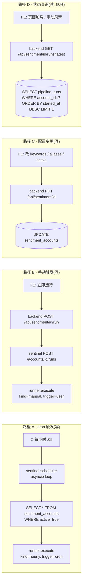
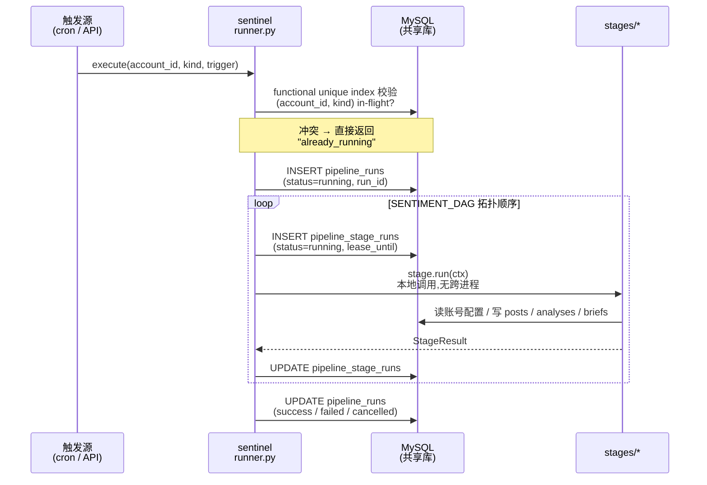
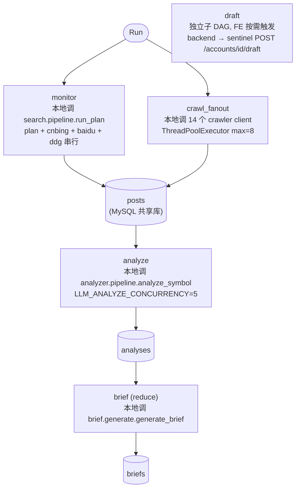
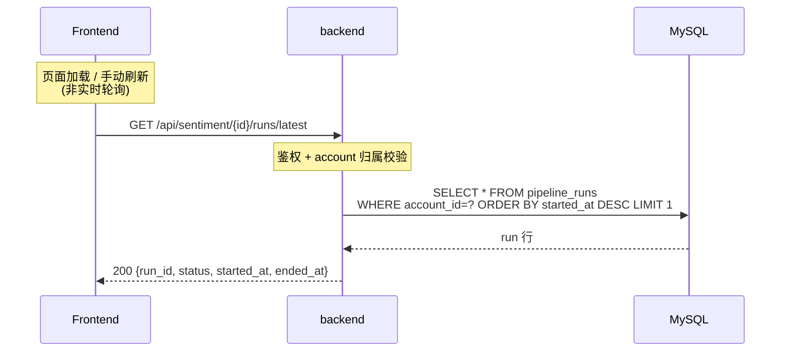

# 舆情系统架构 v2(重构目标 · sentinel 自治 + MySQL 一统)

> 状态:方向已确认,细节待重构期落地
> 创建日期:2026-05-08
> 上一版:[`sentiment-architecture.md`](./sentiment-architecture.md)(描述重构前现状,**不要原地覆盖**)
> 配套文档:[`../../docs/sentiment-gap-analysis-vs-wisersone.md`](../../docs/sentiment-gap-analysis-vs-wisersone.md)
>
> **核心切面**:
> 1. **sentinel-service 自治**:自跑 cron + 自管 DAG runner;backend 退化为账号 / FE 网关
> 2. **MySQL 8.0 一统**:废弃 per-account SQLite + 主库 SQLite/Postgres + sentinel runner.db,**全部进同一 MySQL 库**(`gapex` @ `123.125.194.100:53306`,8.0.35,utf8mb4)
>
> 预计工作量 12-20 工作日,**分 phase 灰度上线**。

---

## 0. 重构动机

把 v1 散在 backend `sentiment_scheduler.py` + `sentiment_pipeline.py` + `sentinel_client.py` 三处的"调度 / 编排 / 状态"逻辑,**整体下沉到 sentinel-service**;**所有持久化数据收敛到一个 MySQL 库**,废弃 per-account SQLite 文件 + 主库 / runner.db 多库分裂。

| 痛点 | v1 现状 | v2 是否覆盖 |
|---|---|---|
| 调度与执行跨进程,语义割裂 | scheduler 在 backend、执行在 sentinel,跨 18 RPC 串起来 | ✓ 全在 sentinel 内 |
| 隐式 DAG | 14 crawler + 4 主 RPC 顺序、并行、容错策略,全靠 200 行 if-else | ✓ 显式 DAG |
| HTTP 长连接 + 业务级超时 | `run_analyze=1800s` 等,任一卡住整 pipeline | ✓ 没有跨进程长连接 |
| 三层防重入语义重复 | scheduler `max_instances=1` + 主库 `last_run_status` + `sentinel_cleanup` | ✓ MySQL functional unique index 一处 |
| stage 级失败粒度缺失 | 14 crawler 失败被吞,无独立 retry | ✓ stage 级 retry + 状态留痕 |
| 数据散在多库多文件 | 主库 + per-account SQLite × N + (本设计原 runner.db) | ✓ 单 MySQL 库,所有表加 `account_id` 列 |
| monkey-patch `connect()` fragile | sentinel 用 ContextVar 切 per-account SQLite 文件 | ✓ **直接消失**(单库单连接池) |
| 跨账号查询 / 运维统计困难 | per-account SQLite 文件隔离 | ✓ 单库自然支持 |

**非目标**:

- 现有 5 张业务表 schema 字段(只换底座 SQLite → MySQL,字段不变)
- LLM provider / 搜索引擎 / 爬虫源
- 引入 Redis / Celery / Airflow / Prefect / Dagster / ES
- 邮件通知功能(本轮砍掉)

---

## 1. 一句话定位

**Sentinel v2 = 自主舆情引擎**:内置 cron 调度、内置 DAG runner、写入共享 MySQL。

**GEO backend v2 = 账号配置中心 + FE API 网关**:写入同一 MySQL;FE 读 / 触发请求经过 backend;状态查询 backend 直查 MySQL,**不再走 sentinel HTTP**。

---

## 2. 物理拓扑

```mermaid
flowchart LR
    subgraph FE["Frontend (React/Vite)"]
        direction TB
        FE_tabs["TodayTab / ArticlesTab / BriefsTab"]
        FE_status["StatusBanner<br/>('上次成功更新于 X')"]
    end

    subgraph BE["GEO backend (FastAPI :8070)"]
        direction TB
        BE_api["geo/api/sentiment.py<br/>账号 CRUD + 状态读 + 触发"]
        BE_client["sentinel_client.py<br/>★ 356 → ~50 行<br/>(只剩 trigger / cancel / draft)"]
        BE_del["sentiment_pipeline.py<br/>sentiment_scheduler.py<br/>★ 整体删除"]
    end

    subgraph SEN["sentinel-service (FastAPI :8090, --workers 1)"]
        direction TB
        SEN_svc["service.py<br/>~3 写端点"]
        SEN_sched["scheduler.py ★<br/>asyncio cron loop"]
        SEN_runner["runner.py ★<br/>DAG runner + reaper"]
        SEN_pipe["pipeline.py ★<br/>DAG 静态声明"]
        SEN_stages["stages/ ★<br/>monitor / crawl_fanout<br/>analyze / brief"]
    end

    subgraph DB[("MySQL 8.0 共享库 (gapex @ 远程)")]
        direction TB
        T_acc[("sentiment_accounts<br/>sentiment_knowledge")]
        T_run[("pipeline_runs<br/>pipeline_stage_runs")]
        T_biz[("posts / analyses / briefs<br/>drafts / query_runs<br/>(全部加 account_id 列)")]
    end

    FE -- HTTPS --> BE_api
    BE_api -- "读 / 写" --> DB
    BE_client -- "trigger / cancel / draft" --> SEN_svc
    SEN_svc --> SEN_runner
    SEN_sched --> SEN_runner
    SEN_runner --> SEN_pipe
    SEN_pipe --> SEN_stages
    SEN_stages -- "读 / 写" --> DB
    SEN_runner -- "读 / 写 状态" --> DB
```

**职责切分**:

- **Frontend**:不变;StatusBanner 显示"上次成功更新于 X"(页面加载时拉一次,不轮询)
- **GEO backend**:拥有 `sentiment_accounts` CRUD;状态查询直查 MySQL,不经过 sentinel
- **sentinel-service**:自跑 cron + DAG;HTTP 入口收到 ~3 个写端点(trigger / cancel / draft);**所有数据写共享 MySQL**

---

## 3. 端到端数据流

### 3.0 整体流程(时间线)

**T0 启动**:backend 起 :8070;sentinel 起 :8090(`--workers 1`),启动 cron loop + reaper 协程

**T1 配置**:FE 改账号 → backend `UPDATE sentiment_accounts`(MySQL),完事(无同步)

**T2 触发**(三选一):
- cron :05 → sentinel 扫 `sentiment_accounts WHERE active=true` → `runner.execute(account_id, kind="hourly")`
- FE 立即运行 → backend → sentinel HTTP → 同上
- 取消 → backend → sentinel HTTP → 写 `pipeline_runs.status=cancelled`

**T3 防重入**:`INSERT pipeline_runs` 触发 functional unique index 校验,同账号同 kind 已 in-flight 则被 SQL 直接拒,返回 `already_running`

**T4 DAG 执行**(全本地函数,sentinel 进程内):

```
(monitor ∥ crawl_fanout) → analyze → brief
```

每 stage:
1. `INSERT pipeline_stage_runs (running, lease_until=now+30min)`
2. 调对应业务模块,读 / 写共享 MySQL(`posts` / `analyses` / `briefs`)
3. 失败按 `retry_policy`(crawler 单点失败 `continue`,LLM 失败重试 2 次)
4. `UPDATE pipeline_stage_runs (success/failed/skipped)`

stage 耗时:monitor 1 分 / crawl_fanout 1-2 分 / **analyze 20-30 分**(主导) / brief 几分钟

**T5 收尾**:`UPDATE pipeline_runs (success/failed)`,functional unique index 自动释放(表达式变 NULL),下次触发可入

**T6 状态查询**:FE 页面加载 → backend `SELECT * FROM pipeline_runs WHERE account_id=? ORDER BY started_at DESC LIMIT 1`(直查 MySQL,**不经过 sentinel**)→ 显示"上次成功更新于 X 分钟前"

**T7 自愈**:reaper 每 5 分钟扫 `status='running' AND lease_until < now()` → 重置 pending(attempt 还有)或 failed;sentinel 进程重启时启动同样的扫描接续

**T8 业务数据访问**:FE 看 posts / briefs → backend 直查 MySQL(带 `WHERE account_id=?` 过滤),与运行时状态完全解耦

**没有的事**:跨进程 HTTP 长连接、邮件通知、配置双写同步、monkey-patch 切 connection、FE 实时轮询、leader 选举、僵尸 cleanup cron

### 3.1 触发与查询路径



**vs 上一版的关键简化**:
- 路径 C 不再"backend 写主库 + 推 sentinel 缓存"两步,**只写一次**(共享 MySQL)
- 路径 D 不再经过 sentinel HTTP,**backend 直查共享 MySQL**

### 3.2 单次 run 执行(在 sentinel 内)



### 3.3 DAG 形态



**实际 DAG 节点数**:`(monitor ∥ crawl_fanout) → analyze → brief` = **4 节点**(draft 独立)

**关键差异 vs v1**:
- 全部 stage 是**本地函数调用**,不再有跨进程 HTTP RPC
- 14 crawler 仍在 `crawl_fanout` 一个 stage 内 fanout(行为一致)
- 单 stage 失败由 runner retry_policy 决定

### 3.4 状态查询接口(backend 直查 MySQL,不经 sentinel)

**核心原则**:运行时状态在共享 MySQL,backend 拥有读权限,**不需要 sentinel 中转**。FE 不实时轮询(只在页面加载 / 手动刷新时拉一次)。**本轮不暴露历史查询**。

**调用时序**:



**端点清单**:

| 端点 | 用途 | 调用方 | 实现 |
|---|---|---|---|
| `GET /api/sentiment/{id}/runs/latest` | 顶层 run 状态 | FE 经 backend(页面加载) | backend 直查 MySQL |
| `GET /api/sentiment/{id}/runs/{run_id}` | 单 run 详情(含 stages),供调试 | 运维 | backend 直查 MySQL |
| `POST /api/sentiment/{id}/run` | 手动触发 | FE | backend → sentinel HTTP |
| `POST /api/sentiment/{id}/runs/{run_id}/cancel` | 取消 | 运维 | backend → sentinel HTTP |
| `POST /api/sentiment/{id}/draft` | 生成回应草稿 | FE | backend → sentinel HTTP |

sentinel 端 HTTP API 现在只有 ~3-4 个写端点 + `/health`;**读全部走 backend 直查 MySQL**。

---

## 4. 模块清单

### 4.1 sentinel-service

| 模块 | 关键文件 | 入口 | v1→v2 |
|---|---|---|---|
| Cron 调度 ★ | `scheduler.py` | startup hook 启动 asyncio loop | **新增 ~150 行**(替代 backend `sentiment_scheduler.py`)|
| DAG runner ★ | `runner.py` | `runner.execute(account_id, kind, trigger)` | **新增 ~600 行**:节点遍历 + retry + lease + reaper |
| DAG 声明 ★ | `pipeline.py` | `SENTIMENT_DAG: DAG = ...` | **新增 ~100 行** |
| Stage 实现 ★ | `stages/{monitor,crawl_fanout,analyze,brief}.py` | `def run(ctx) -> StageResult` | **新增 ~350 行**(薄 wrapper) |
| HTTP 入口 | `service.py` | `POST /accounts/{id}/runs`, `/cancel`, `/draft`, `GET /health` | 779 行 → **~150 行**;**18 写 RPC → 3** |
| 业务模块 | `search/` `crawler/` `analyzer/` `brief/` `response/` | 各自原入口 | **不动**(被 stages/ 调用) |
| 数据访问 ★ | `storage/db.py` | `get_session()`(SQLAlchemy) | **重写**:从 SQLite per-file 改成 MySQL 单连接池;monkey-patch 删除 |
| LLM 抽象 / 知识库 | `llm_client.py` / `knowledge/*.md` | — | **不动** |

### 4.2 GEO backend

| 模块 | v1→v2 |
|---|---|
| `sentiment_pipeline.py` | **整体删除**(223 行) |
| `sentiment_scheduler.py` | **整体删除**(187 行) |
| `sentinel_client.py` | 356 行 → **~50 行**(`trigger_run` / `cancel_run` / `gen_draft` + 健康检查) |
| `geo/api/sentiment.py` | 484 → ~520(状态读改成本地 SQL,新增 `runs/latest` endpoint) |
| `geo/database.py` / models | 沿用 SQLAlchemy;迁到共享 MySQL `gapex`;**与 sentinel 共用 schema** |

### 4.3 Frontend

| 模块 | v1→v2 |
|---|---|
| `StatusBanner.tsx` | 74 → ~120,显示"上次成功更新于 X";`failed` 静默 |
| 其它 | 不动 |

---

## 5. 数据模型

**全部表都在共享 MySQL `gapex` 库,utf8mb4 / utf8mb4_unicode_ci**。

### 5.1 配置表(backend 拥有写权限)

| 表 | 主键 | 用途 |
|---|---|---|
| `sentiment_accounts` | `id` | 用户 ↔ 账号 1:N;`(user_id, ticker)` 唯一 |
| `sentiment_knowledge` | `(account_id, kind)` | 每账号 3 条:brand_voice / legal_redlines / response_playbook |

### 5.2 业务表(sentinel 写,backend 读)

**v1 是 per-account SQLite 文件,v2 是 MySQL 单库,所有表加 `account_id` 列**。

| 表 | 主键 | 关键字段 |
|---|---|---|
| `posts` | `(account_id, source, post_id)` | `ingested_at`(今日筛选键) |
| `analyses` | `(account_id, source, post_id)` | `is_relevant`、`risk_level`、`sentiment_*` |
| `briefs` | `id`,索引 `(account_id, symbol, date)` | Markdown |
| `drafts` | `id` | `variant`、可挂 post 或 topic |
| `query_runs` | `(account_id, symbol, query)` | adaptive timelimit |

JSON 数组字段(`emotions[]` / `topics[]` / `entities[]` / `risk_signals[]`)用 MySQL `JSON` 类型 + 多值索引(8.0.17+)支持 `MEMBER OF` / `JSON_OVERLAPS` 查询。

### 5.3 运行时状态(sentinel 写,backend 读)

| 表 | 主键 | 关键字段 |
|---|---|---|
| `pipeline_runs` | `id`(自增,即 run_id) | `account_id`, `kind`, `trigger`, `status`, `started_at`, `ended_at`, `error` |
| `pipeline_stage_runs` | `(run_id, stage_id, attempt)` | `status`, `started_at`, `ended_at`, `error`, `output_summary` (JSON), `lease_until` |

### 5.4 防重入唯一索引(MySQL 8.0 functional index)

MySQL 8.0 没有原生 partial unique index,但有 functional unique index,可用 `CASE` 表达式实现等效约束:

```sql
ALTER TABLE pipeline_runs ADD UNIQUE KEY uniq_active_run (
  (CASE
     WHEN status IN ('pending','running')
     THEN CONCAT(account_id,'|',kind)
   END)
);
```

`status` 不在 (pending, running) 时表达式为 NULL,MySQL 唯一索引允许多个 NULL → 历史 run 不冲突。`status` 进入 (pending, running) 时表达式产生具体值,同一 `(account_id, kind)` 重复入队会被 SQL 层直接拒。

### 5.5 多租户隔离

**v1 的 monkey-patch `connect()` 完全消失**。单 MySQL 库 + 单连接池;隔离靠应用层 `WHERE account_id = ?` 强制带过滤条件。每个 stage 实现入口拿 `account_id` 作为参数,SQL 必带条件。

ORM 层(SQLAlchemy)可加一个 query helper 强制注入 `account_id` filter,降低漏写风险。

---

## 6. 任务编排与状态机

### 6.1 状态机

```
pipeline_runs.status:        pending → running → success / failed / cancelled
pipeline_stage_runs.status:  pending → running → success / failed (重试) / skipped
```

### 6.2 重入控制(从三层归一)

| v1 守卫 | v2 |
|---|---|
| backend scheduler `max_instances=1` | **删除**(scheduler 整体下沉) |
| 主库 `last_run_status='running'` | **删除** |
| backend `sentinel_cleanup` 60min 僵尸回收 | **删除**(sentinel runner reaper 取代) |
| **新增**:MySQL functional unique index + lease reaper | |

### 6.3 stage 失败策略

每 stage 在 DAG 声明里带 `retry_policy`:`max_attempts` / `backoff` / `on_failure`(`fail_run` / `skip_downstream` / `continue`)。

14 crawler 失败处理:在 `crawl_fanout` stage 内 ThreadPoolExecutor + try/except 兜底,失败留痕在 `output_summary.failed_sources`。

### 6.4 lease + reaper

每 stage 进入 running 时写 `lease_until = now + N min`(默认 30,analyze 设 45)。runner 内置 reaper 协程每 5 分钟扫 `status='running' AND lease_until < now()`,重置回 pending(若 attempt 还有)或 failed。

---

## 7. LLM 用法

不变。重构只改调用方式,不改模型 / prompt / 并发。

---

## 8. 前端切片

| 入口 | v1→v2 |
|---|---|
| `Sentiment.tsx` / `StatusBanner` | 不实时显示进度;页面加载时拉一次顶层 run 状态,显示"上次成功更新于 X";`failed` 静默 |
| 其它 tab / wizard | **不动** |

---

## 9. 关键设计决策

1. **scheduler 整体下沉到 sentinel**(uvicorn `--workers 1` + asyncio cron)
   - **理由**:调度与执行同进程,失败语义在一处收敛
   - **取舍**:sentinel 必须单进程;backend 短暂宕机不影响

2. **MySQL 8.0 一统持久化**
   - **决策**:废弃 v1 的"主库 + per-account SQLite × N";所有表(配置 / 业务 / 运行时状态)进一个 MySQL 库,业务表加 `account_id` 列
   - **理由**:实测远端 MySQL 8.0.35,utf8mb4,functional index / JSON 多值索引齐备,完全够用;单库 = 单连接池 = monkey-patch 直接消失;跨账号查询 / 备份 / 监控天然集中
   - **取舍**:跨进程访问同一库,sentinel 与 backend 共享 schema,任一方改 schema 要双方协调(用 alembic 集中管理)
   - **不选 ES / Postgres / SQLite**:ES 不擅长状态机,Postgres 需新部署,SQLite per-file 是当前痛点

3. **配置不再"双写同步"**
   - **决策**:`sentiment_accounts` 是共享表,backend 写 / sentinel 读;无 cache、无 sync API
   - **理由**:单库 → 一致性问题消失
   - **取舍**:sentinel 每 cron tick 都 SELECT 一次配置(便宜,有索引)

4. **状态查询不经 sentinel HTTP**
   - **决策**:backend 直查共享 MySQL 的 `pipeline_runs` / `pipeline_stage_runs`
   - **理由**:省一跳 + sentinel HTTP 收敛到只剩"trigger / cancel / draft"3 个写端点
   - **取舍**:backend 知道 sentinel 的状态表 schema,有耦合;通过共享 ORM 模型缓解

5. **FE 不实时显示任务执行状态**
   - **决策**:不轮询、不显示 stage 级进度;StatusBanner 只在页面加载时拉一次
   - **理由**:用户感知靠业务数据;少一条高频查询
   - **取舍**:用户不知道"任务正在跑"(可接受)

6. **不暴露历史查询能力**
   - **决策**:只 `runs/latest` + `runs/{run_id}` 稳定 URL
   - **取舍**:`pipeline_runs` 表会缓慢增长,定期 cron 删旧

7. **DIY runner,不引入 framework**

8. **14 crawler 不拆 DAG 节点,留在一个 stage 内 fanout**

9. **DAG 是静态 Python 对象,声明式**

10. **不做邮件通知**:`notify_emails` 字段保留 schema 但本轮无消费者

---

## 10. 与 v1 的差异(逐点)

| v1 节 | v1 现状 | v2 |
|---|---|---|
| §2 物理拓扑 | sentinel 是 18 写 RPC server,backend 编排 | sentinel 自跑 cron + DAG;backend 退化 |
| §3 数据流 | backend 调度,逐 stage HTTP RPC | sentinel 调度,DAG 内本地函数 |
| §4 模块 | backend 三大编排文件 + sentinel 6 子模块 | backend 三大文件删除;sentinel 加 scheduler / runner / pipeline / stages |
| §5 backend 编排 | 调用 18 RPC + try/except 14 次 | 调用 ~3 RPC(trigger / cancel / draft) |
| §5 调度 | APScheduler + leader 选举 + SQLAlchemyJobStore | sentinel asyncio loop + 单进程 |
| §6 持久化 | 主库 + per-account SQLite × N + monkey-patch connect | **共享 MySQL 一库,加 `account_id` 列;monkey-patch 消失** |
| §6 状态机三层守卫 | scheduler / pipeline / cleanup | functional unique index + reaper |
| §7 前端 | StatusBanner 顶层 4 态 | 同 v1 但显示"上次成功更新于 X" |

---

## 11. 上线路径

按"低风险先建、热路径最后切"分 phase。

### Phase 0:基础设施(不影响线上)

- 在 `gapex` 库建 v2 全套 schema(配置 / 业务 / 运行时状态),用 alembic 管理
- 编写 SQLite → MySQL 数据迁移脚本(per-account SQLite 文件 → MySQL 单库,加 `account_id` 列)
- sentinel 写 `runner.py` + `pipeline.py` + `stages/` + 单测;数据访问层从 SQLite per-file 改成 MySQL ORM
- backend `sentinel_client.py` 加新 3 个方法(老 18 个并存)

### Phase 1:数据双写(无业务影响)

- v1 仍跑(写 per-account SQLite),**同时**写一份到 MySQL 共享库
- 验证两边数据一致(对账脚本)

### Phase 2:sentinel 内部 runner 影子运行

- sentinel 加 cron loop,但 **DAG 模拟跑**(stage = no-op)只写状态表
- 验证 cron 时序、unique index、reaper 工作正常

### Phase 3:hourly run 完整切过(热路径)

- sentinel cron 真正执行完整 DAG,backend 关闭老 scheduler + pipeline
- 双轨并存 1 周(老 scheduler 设 `enabled=false` 但代码留)
- 验证 run 失败率 / 单 run 总耗时 / stage 级耗时分布
- per-account SQLite 文件继续保留只读 1 周作为回滚兜底

### Phase 4:清理

- 删 backend `sentiment_pipeline.py` + `sentiment_scheduler.py`
- 删 backend `sentinel_client.py` 老 18 个 RPC 方法
- 删 sentinel `service.py` v1 写 RPC
- 删 per-account SQLite 文件;sentinel `storage/` 旧 monkey-patch 代码删除
- alembic drop v1 残留字段

### 回滚

- Phase 1:停双写
- Phase 2:disable cron loop
- Phase 3:**关键回滚点** — 重启 backend scheduler,sentinel cron 关闭;运行时状态短暂不一致(几小时)
- Phase 4 不可逆,只在 Phase 3 稳定 4 周以上后执行

---

## 12. 风险与未决项

- [ ] **共享 MySQL 单实例 = 单点**:崩了 backend / sentinel 全停;**缓解**:production 用 RDS + 主从 + 自动 failover;dev 现状(单 MySQL container)接受单点
- [ ] **`innodb_buffer_pool_size=128MB` 太小**:实测远端 MySQL 默认值,数据上来后 IO 飙;**待办**:DBA 调到 ≥ 1-2 GB(实例内存 50%)
- [ ] **`innodb_flush_log_at_trx_commit=1` + `sync_binlog=1`**:每次 commit 都 fsync,DAG 高频小 commit 时是瓶颈;**待办**:评估能否放宽到 `sync_binlog=100`(损失少量崩溃恢复换性能)
- [ ] **跨账号数据集中 = 多租户漏写风险**:any SQL 漏 `WHERE account_id=?` 就跨租户;**缓解**:ORM helper 强制注入;code review checklist;集成测试覆盖
- [ ] **`pipeline_runs` 增长**:每小时 N 账号 ≈ 24N 行/天;`pipeline_stage_runs` 4 倍;N=100 时 ~10k 行/天;**待办**:cron 定期 DELETE 30 天前
- [ ] **lease 时长**:默认 30 分钟,analyze 实测 20–30 分钟,临界;**待办**:监控 P99 × 2 调
- [ ] **DAG 学习成本**:`pipeline.py` 顶部画 ASCII DAG 注释 + 维护本文档 §3.3
- [ ] **stage_id 命名稳定性**:发布后不能改名,常量化 + deprecate 流程
- [ ] **sentinel 单进程**:容量 N×4min/h ≈ N=100 时占 7%,够;真不够再分账号 sharding
- [ ] **跨进程鉴权**:backend → sentinel HTTP 用 `X-Internal-Token`(env)
- [ ] **schema 变更协调**:backend 与 sentinel 共享表,任一方改 schema 要 alembic + 双方部署同步

---

## 13. 关键路径速查

| 想看 / 改 X | 去 Y |
|---|---|
| Cron 在哪触发 | `services/sentinel-service/scheduler.py` |
| DAG 长什么样 | `services/sentinel-service/pipeline.py` |
| DAG runner / 重试 / lease / reaper | `services/sentinel-service/runner.py` |
| stage 实现 | `services/sentinel-service/stages/<name>.py` |
| stage retry / lease 配置 | `pipeline.py` 节点声明里的 `retry_policy=...` |
| run / stage 当前状态 | MySQL `pipeline_runs` / `pipeline_stage_runs` |
| 账号配置 | MySQL `sentiment_accounts`(backend 写 / sentinel 读) |
| backend 触发 sentinel | `geo/services/sentinel_client.py:trigger_run()` |
| FE 拉 run 顶层状态 | backend `GET /api/sentiment/{id}/runs/latest`(直查 MySQL,不经 sentinel) |
| LLM prompt | `services/sentinel-service/analyzer/prompts.py`(不动) |
| 业务表 schema | MySQL `gapex` 库 `posts` / `analyses` / `briefs` / `drafts` / `query_runs` |
| MySQL 连接信息 | `.env` 的 `DB_HOST` / `DB_PORT` / `DB_NAME=gapex` 等 |
| schema 迁移 | `backend/migrations/`(alembic) |
